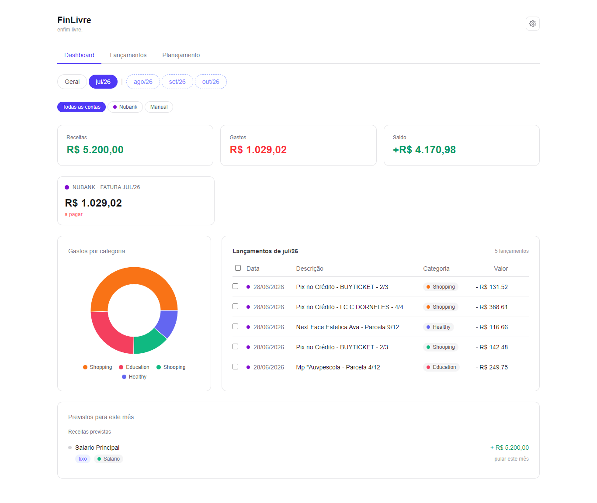
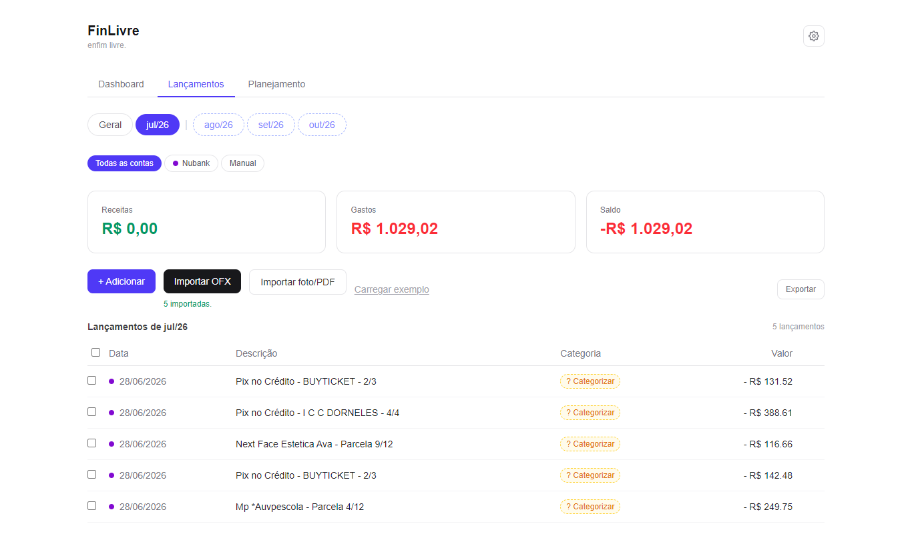
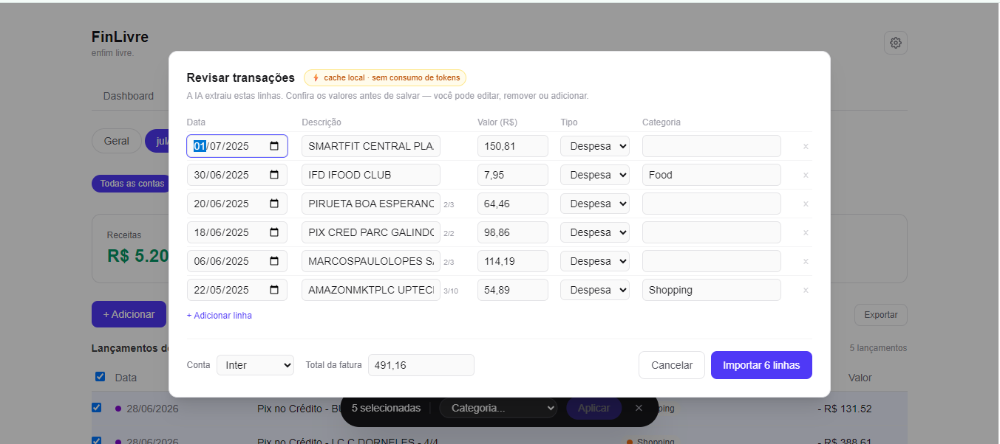
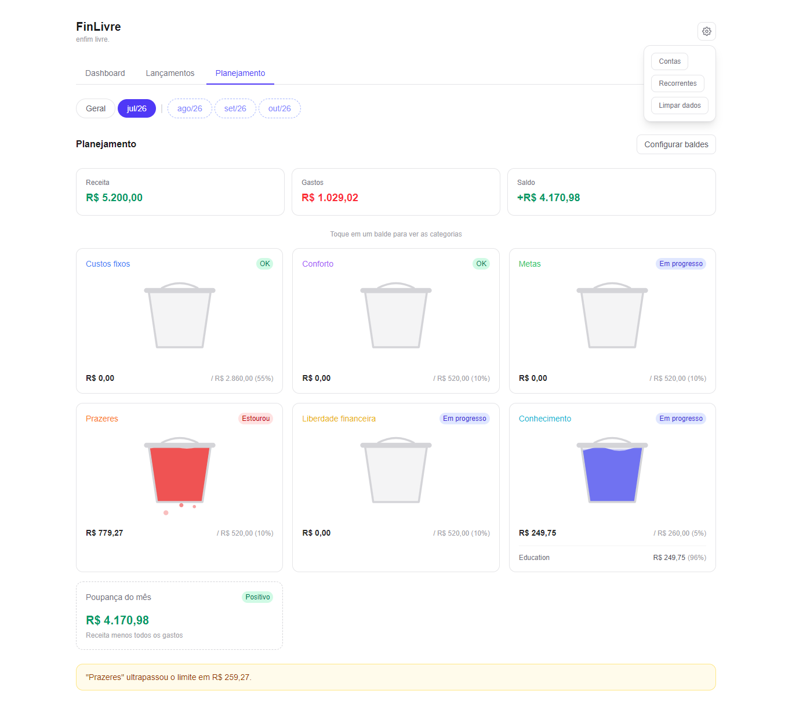

# FinLivre

*Enfim livre. Organize your finances and finally be free.*

**Live app:** [finlivre.vercel.app](https://finlivre.vercel.app). Click "Carregar exemplo" on the Lançamentos page to try it with sample data, no signup needed.

## Why I built this

I use credit cards for almost everything, spread across more than one bank. Every month I had the same problem: I knew I was spending, but I couldn't see where. Each bank shows its own invoice in its own app, installments (parcelas) hide future commitments, and no app gave me a single honest picture of my money. The popular Brazilian finance apps either want my bank credentials, push my data to their servers, or bury the useful stuff behind a subscription.

So I built my own. FinLivre imports my real statements, categorizes everything, and shows me the one thing I actually wanted: where my money goes, what's already committed to future months, and whether I'm living inside my plan or not. I use it every month with my own data. That's also why it's local-first: my financial data stays in my browser, period.

## What it does

**Import your statements, your way.** Upload an OFX file from your bank and every transaction is parsed, categorized and deduplicated instantly, all in the browser. For banks that only give you a PDF, or don't even give you that (Inter Bank (Digital Bank from Brazil) shows the open invoice only inside the app), you can import from a photo or PDF using Claude Vision with your own API key. The AI-extracted lines land in an editable review table so you check everything before it's saved.

**Categorization that learns.** A seed dictionary guesses the category from the merchant name (UBER EATS before UBER). When you correct one, that correction is saved as a rule and applied automatically next time. In the first month you categorize a couple dozen unknowns; after that it's mostly automatic. You can also select several transactions and categorize them in one batch.

**Installments and recurring items, projected.** Parcelas show up with their 3/12 badge, and future months are computed on the fly from installment math plus your recurring items (salary, rent, subscriptions). Future months are never written to the database, they're always derived, so there's no risk of double counting when the real statement arrives. You can override or skip a recurring item for a single month without touching the rule.

**Dashboard.** Income vs expense, net balance, spending by category donut, per-account invoice cards ("Nubank, fatura de julho: R$ 1.029,02 a pagar"), and a transactions table, all filterable by month and by account. Each account gets a color so you can tell rows apart at a glance.

**Planejamento (budget buckets).** A 50/30/20 style planning view with configurable buckets (Custos fixos, Conforto, Metas, Prazeres...). Each bucket is an animated SVG that fills up as you spend against a target percentage of your monthly income. Spending buckets full means alert; goal buckets full means victory. It also shows your real savings rate vs your target and warns when a bucket overflows.

**Your data is yours.** Everything is stored in IndexedDB in your browser. There is no backend, no account, no tracking. Export everything to JSON or CSV whenever you want.

**Light, dark, or system — and English or Portuguese.** A theme toggle in the header switches instantly with no flash on load, persisted across sessions. The whole UI is available in English and Portuguese via a language switcher next to it.

## Screenshots

| Dashboard | Lançamentos |
|---|---|
|  |  |

| Vision import (AI review) | Planejamento (animated buckets) |
|---|---|
|  |  |

## Highlights

**Local-first, zero backend.** All data lives in the browser via Dexie (IndexedDB). The schema has evolved through four versions (see `src/lib/db.ts`), each one an additive migration that runs automatically in the user's browser on first load. No server, no auth, nothing to provision.

**Two import paths, one privacy story.** The OFX parser is deterministic, hand-written, and never touches the network. That was a deliberate choice: parsing a known format is a job for code, not for AI. The AI path exists only where determinism can't reach (photos and PDFs), it's opt-in, and it calls Anthropic directly from the browser with the user's own key stored in localStorage. No project key, no proxy server, no data through my hands.

**Everything is an Entry.** OFX, Vision, manual entries and recurring items are just four importers that produce the same `Entry` shape into one ledger. The dashboard, filters and budget rollups never know where a row came from. Adding a new import source means writing one importer function, not touching the UI.

**SMIL for the bucket animation.** The liquid-filling bucket uses SVG's native `<animateTransform>` instead of CSS transforms. CSS transforms on SVG elements resolve in CSS pixels while the SVG geometry (viewBox, clipPath, paths) lives in SVG user units, so mixing them makes the fill drift at different viewport sizes. SMIL animates inside the SVG coordinate system, so the clipped liquid stays accurate at any size with no JS animation loop.

**Money as integer cents.** Amounts are stored as `amountCents` integers, never floats. R$ 24,90 is 2490. Floating point money is how you get rounding bugs.

**Tested.** United tests with jest.

## Tech

- Next.js 16 (App Router) and React 19
- TypeScript
- Tailwind CSS v4
- Dexie (IndexedDB) for local-first storage
- Recharts for data visualization
- Anthropic SDK (Claude Vision, BYO key) for the optional AI import
- next-themes for the light/dark/system toggle
- A small custom i18n layer for English/Portuguese

## Getting started

```bash
npm install
npm run dev
```

Open http://localhost:3000.

## Roadmap

1. OFX import, categorization and a spending dashboard ✅
2. Manual entries and income, income vs expense, net cashflow ✅
3. Recurring commitments, installment forecasting, account management ✅
4. Invoice cards, export (JSON/CSV), all-time dashboard, tests ✅
5. Import an invoice from a photo or PDF via Claude Vision (BYO key) ✅
6. Account filters, stable category colors, recurring overrides ✅
7. App Router navigation (Dashboard / Lançamentos / Planejamento) ✅
8. Budget buckets (50/30/20 style planning view) ✅
9. Unified import review screen, so OFX gets the same editable review table Vision already has ✅
10. Dark mode, theme toggle, and English/Portuguese language support ✅
